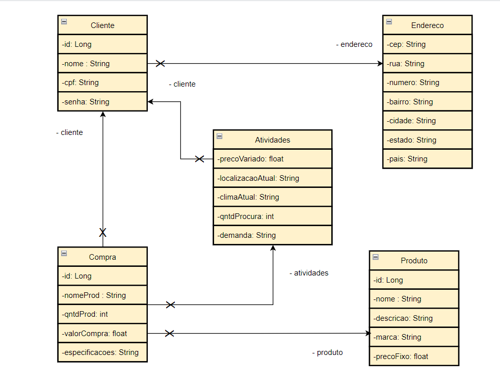

# SavvyFix - Precificação dinâmica

## Lista dos integrantes:
### Douglas Magalhães de Araujo - 552008

Responsável pelas pesquisas, diagramação e banco de dados.

### Gustavo Argüello Bertacci - 551304

Responsável por Java e pelo suporte.

### Luiz Fillipe Farias - 99519

Responsável principal por Java e pesquisa.

### Rafaella Monique do Carmo Bastos - 552425

Responsável pela documentação, banco de dados, prototipação e pitch.

## Instrução de como rodar a aplicação

Para o funcionamento deve certificar das configurações da IDE.

Inicie o projeto e verifique as respostas dos endpoints pelo endereço do localhost.

## Imagens dos Diagramas

### Diagrama Entidade-Relacionamento

### Modelo Entidade-Relacionamento

### Diagrama de Classes

## Link do pitch da proposta
https://youtu.be/ltPanBm_5ks

## Endereços dos EndPoints

### Endereco

localhost/enderecos GET
 

localhost/enderecos/cep/{cep} - GET
 

localhost/enderecos  - POST
 

### Produtos

localhost/produtos - GET
 

localhost/produtos/{id}  - GET
 

localhost/produtos  - POST
 

### Atividades

localhost/atividades  - GET

localhost/atividades/precoVariado/{precoVariado} - GET
 

localhost/atividades - POST
 

### Clientes

localhost/clientes GET
 

localhost/clientes/{id} GET 
 

localhost/clientes  - POST

### Compra

localhost/compras  - GET
 

localhost/compras/{id} GET
 

localhost/compras  - POST
 

